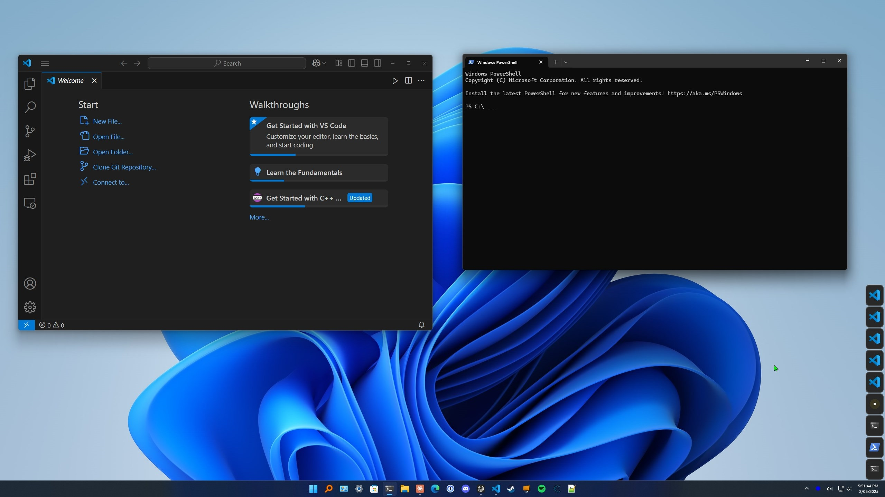
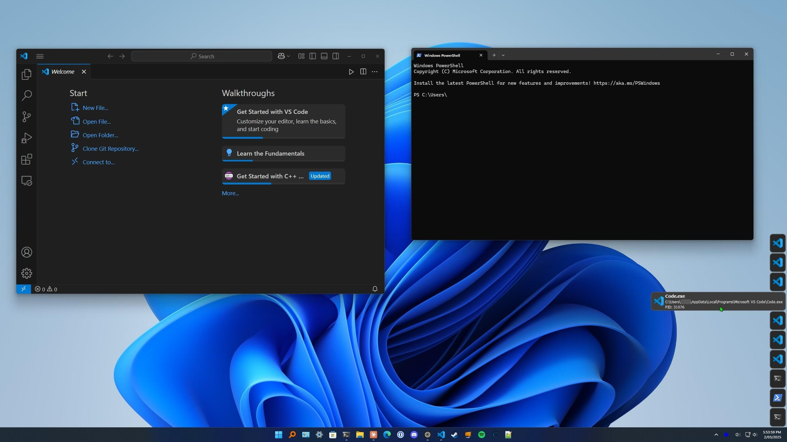
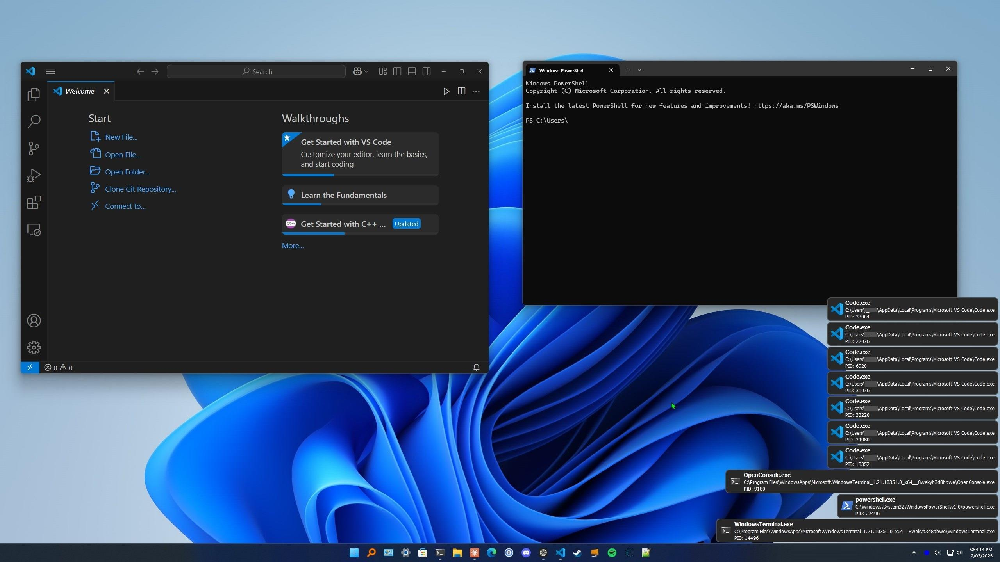
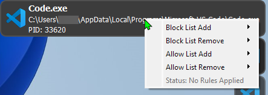
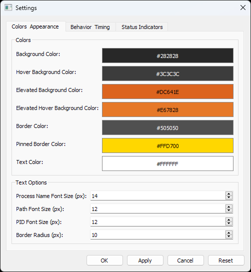
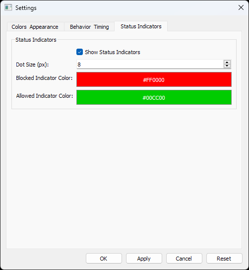
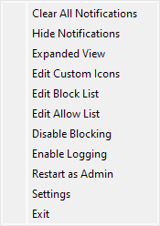

# Process Monitor (procmon)

A Windows system tray application that monitors new processes as they start, displays notifications. Built with Python and PyQt5.

## Features

- **Process Monitoring**: Real-time monitoring of new processes
- **Process Notifications**: Desktop notifications when new processes start
- **Notification Filtering**: Block notifications for specific processes
- **Notification Allowing**: Override block rules to show notifications for specific processes
- **Custom Icons**: Support for custom icons for processes
- **Elevated Process Detection**: Identify processes running with administrative privileges
- **Configurable Settings**: Customize appearance, behavior, and rules
- **System Tray Integration**: Runs from your system tray for easy access
- **Hierarchical Rules**: Sophisticated rule system with path, name, and directory-based rules

## Prerequisites

- Windows 10 or newer
- Python 3.7+ 
- PyQt5
- psutil
- pywin32 (win32api, win32con, etc.)
- Pillow (PIL)

## Screenshots

### Main Notification




### Context Menu


### Settings Dialog




### System Tray Menu


## Installation

1. Clone this repository:
```bash
git clone https://github.com/Solenya25/PyQt5-procmon.git
cd procmon
```

2. Create a virtual environment (recommended):
```bash
python -m venv venv
venv\Scripts\activate
```

3. Install the dependencies:
```bash
pip install PyQt5 psutil pywin32 Pillow
```

4. Run the application:
```bash
python procmon.py
```

## Usage

### Process Monitoring

The application automatically monitors new processes as they start. When a new process starts, a notification will appear in the bottom-right corner of your screen with:
- Process name
- Full path
- Process ID (PID)
- Administrative status (if running as admin)

### Notification Interaction

Notifications provide several interaction options:

- **Hover** over a notification to prevent it from disappearing and expand it
- **Single-click** to open the process's file location in Explorer
- **Double-click** to pin the notification, preventing it from disappearing
- **Right-click** to access the context menu with block/allow options

### View Modes

The application supports two view modes for notifications:

- **Collapsed View**: Shows only the process icon
- **Expanded View**: Shows the process icon, name, path, and PID

Toggle between these modes by right-clicking the system tray icon and selecting "Expanded View" or "Collapsed View".

### Filtering Process Notifications

Right-click on a notification to access the block/allow menu. Note that these settings only control which notifications are displayed - they do not actually prevent processes from running. The application uses a hierarchical rule system:

#### Rule Priority (highest to lowest)
1. Exact path match in allow list (shows notification)
2. Exact path match in block list (hides notification)
3. Process name match in allow list (shows notification)
4. Process name match in block list (hides notification)
5. Directory match in allow list (shows notification, deeper paths override shallower paths)
6. Directory match in block list (hides notification, deeper paths override shallower paths)
7. "ALL" rule in block list (hides notifications for all processes)

#### Adding Rules
From the notification context menu, you can:

- **Block by Path**: Hide notifications for this specific executable file
- **Allow by Path**: Show notifications for this specific executable file
- **Block by Name**: Hide notifications for all executables with this filename
- **Allow by Name**: Show notifications for all executables with this filename
- **Block by Directory**: Hide notifications for all executables in a specific directory
- **Allow by Directory**: Show notifications for all executables in a specific directory

### Rule Management

You can view and edit block and allow rules directly:

1. Right-click the system tray icon
2. Select "Edit Block List" or "Edit Allow List"
3. Rules are stored in simple text files:
   - One rule per line
   - Full paths must include drive letter and full directory structure
   - Directory rules must end with a backslash (\)
   - Process name rules are just the executable name (e.g., "notepad.exe")
   - Use "#" for comments

### Custom Icons

You can assign custom icons to specific processes:

1. Right-click the system tray icon and select "Edit Custom Icons"
2. Add entries in the format: `"path_to_executable.exe", "icon_name"`
3. Place icon files (PNG, ICO, etc.) in the `resources/custom_icons` folder

### Administrative Privileges

Some features require administrative privileges:

- Blocking system processes or services
- Monitoring processes started by other admin-level applications

To run the application with admin rights:

1. Right-click the system tray icon
2. Select "Restart as Admin"

### Settings

Access the settings dialog by right-clicking the tray icon and selecting "Settings". You can customize:

#### Colors & Appearance
- Background colors (normal, hover, elevated)
- Border colors
- Text colors
- Font sizes
- Border radius

#### Behavior & Timing
- Display time before fade-out
- Fade duration
- Process polling interval
- Maximum number of notifications
- Screen position margins

#### Status Indicators
- Enable/disable status indicators
- Indicator size
- Indicator colors

## Configuration Files

The application uses several configuration files in the `resources` folder:

- `block_list.txt`: List of processes for which to hide notifications
- `allow_list.txt`: List of processes for which to show notifications (overrides block list)
- `custom_icons.txt`: Mappings of processes to custom icons
- `settings.json`: Application settings
- `process_monitor.log`: Application logs (when logging is enabled)

### Example Block/Allow List Format
```
C:\Program Files\Example\example.exe  # Hide/show notifications for specific executable
example.exe  # Hide/show notifications for all executables with this name
C:\Program Files\Example\  # Hide/show notifications for all executables in this directory
ALL  # Special rule to hide notifications for all processes (block list only)
```

### Example Custom Icons Format
```
"C:\Program Files\Example\example.exe", "example_icon"
"example.exe", "example_icon"
```

## Troubleshooting

### Common Issues

- **No notifications appear**: Ensure the application is running and notifications are enabled in the system tray menu.
- **Cannot filter notifications for system processes**: Try running the application as administrator.
- **Icons not appearing correctly**: Check the custom_icons.txt file format and ensure icons are in the right folder.

### Enabling Logging

Logs are stored in the `resources/process_monitor.log` file. To enable detailed logging:

1. Right-click the system tray icon
2. Select "Enable Logging"

## License

[MIT License](LICENSE) - see the LICENSE file for details.
