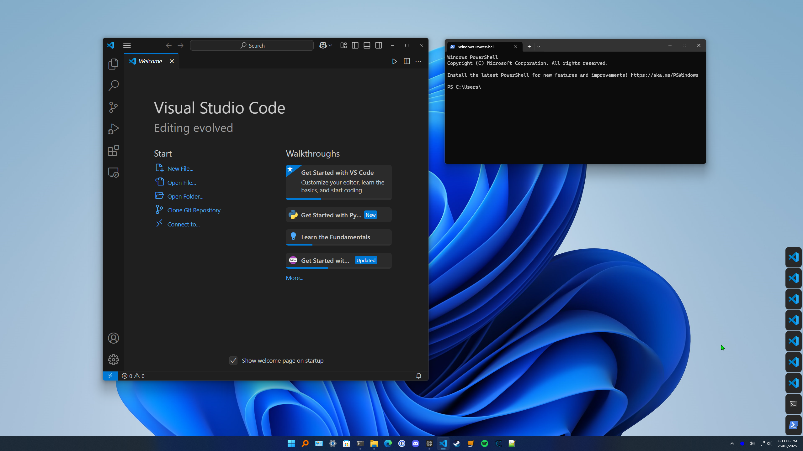
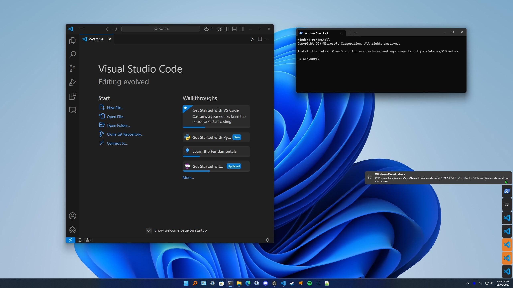
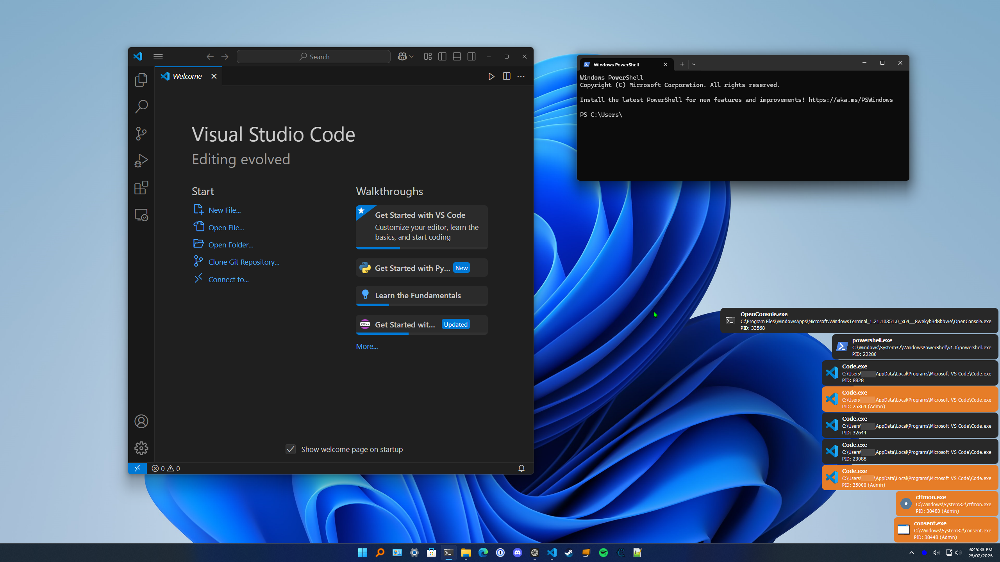

# PyQt5 procmon

A lightweight process monitoring tool that displays notifications for newly launched processes on Windows. Get real-time visibility into what's running on your system with elegant, non-intrusive notifications.

## Features

- **Real-time Process Monitoring**: Receive instant notifications when new processes start
- **Admin Privilege Detection**: Notifications for elevated processes are highlighted in orange
- **Process Blocking**: Right-click notifications to block specific applications from future alerts
- **Custom Icons**: Assign custom icons to specific applications for better visual recognition
- **Minimal Interface**: Runs entirely in the system tray with no main window
- **Expanded/Collapsed Views**: Toggle between detailed and compact notification styles
- **Lightweight**: Minimal system resource usage

## Screenshots

### Collapsed Views

| Collapsed View | Expanded Collapsed View |
|----------------|---------------|
|  |  |

### Expanded View

| Expanded View | 
|---------------|
| 

## Installation

### Prerequisites

- Windows operating system
- Python 3.7 or higher
- Required Python packages:
  - PyQt5
  - psutil
  - Pillow (PIL)
  - pywin32

### Option 1: Download the Release

1. Download the latest release from the [Releases page](https://github.com/Solenya25/PyQt5-procmon/releases)
2. Extract the ZIP file to your preferred location
3. Run `start-procmon.bat` to launch the application without a console window

### Option 2: Install from Source

1. Clone the repository:
   ```
   git clone https://github.com/Solenya25/PyQt5-procmon.git
   ```

2. Navigate to the project directory:
   ```
   cd PyQt5-procmon
   ```

3. Install required dependencies:
   ```
   pip install PyQt5 psutil Pillow pywin32
   ```

4. Run the application:
   ```
   python procmon.py
   ```
   
   Or use the included batch file to run without a console window:
   ```
   start-procmon.bat

   ```

## Usage

### System Tray Menu

Right-click the system tray icon to access the application menu:

- **Clear All Notifications**: Remove all current notifications
- **Hide/Show Notifications**: Toggle notification visibility
- **Expanded/Collapsed View**: Switch between detailed and compact notifications
- **Edit Custom Icons**: Customize icons for specific applications
- **Edit Block List**: Manage blocked applications
- **Enable/Disable Blocking**: Toggle the blocking functionality
- **Enable/Disable Logging**: Toggle debug logging
- **Restart as Admin**: Restart the application with administrative privileges
- **Exit**: Close the application

### Notification Interactions

- **Hover**: Reveals full application path (in collapsed mode)
- **Left-click**: Opens the application's folder location
- **Right-click**: Adds/removes the application to/from the block list

### Customization

#### Custom Icons

Edit the `resources/custom_icons.txt` file to map specific processes or applications to custom icons:

```
# Format: "Path", "Icon name" no image extension
# Format: "Process name.exe", "Icon name" no image extension
# Example: "C:\Program Files\MyApp\example.exe", "example_icon" no image extension
# Example: "example.exe", "example_icon" no image extension
```

Place your custom icons (.ico, .png, .jpg, .jpeg, .bmp) in the `resources/custom_icons` folder.

#### Block List

Edit the `resources/block_list.txt` file to prevent notifications for specific processes:

```
# Add/remove entries automatically by right-clicking notifications
# Add full path to block specific processes
# Example: C:\Program Files\MyApp\MyApp.exe
# Add folder path to block all processes in a directory
# Example: C:\Program Files\
# Add process name for blanket blocking
# Example: MyApp.exe
```

## Auto Start with Windows

To make Process Monitor start automatically with Windows:

1. Create a shortcut to `start-procmon.bat`
2. Press `Win + R`, type `shell:startup`, and press Enter
3. Move the shortcut to the Startup folder that opens

## Technical Details

Process Monitor uses the following techniques to extract and display process information:

- Windows API calls to detect new processes
- Icon extraction from executable files
- UWP application icon extraction
- Administrative privilege detection
- Custom caching system for better performance

## License

This project is licensed under the MIT License - see the [LICENSE](LICENSE) file for details.

## Acknowledgements

- Icon extraction code adapted from multiple sources for maximum compatibility
- Built with PyQt5 for the user interface components
